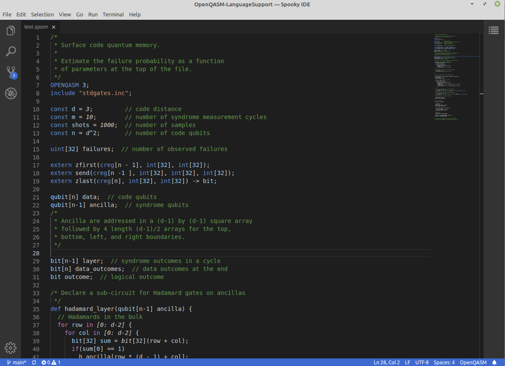

# SpookyIDE
**The world's first dedicated IDE for quantum hardware design!**

## Description

SpookyIDE is an open-source IDE designed to help you get started designing and building your very own quantum circuits.

## Features:

### Currently Implemented

1. QASM Language Syntax Highlighting
2. Access to VSIX extension repositories

### Planned Features

* Circuit Simulation
* Quantum RTL Synthesis via [QEDA](https://github.com/Spooky-Manufacturing/QEDA)
  - Automated Schematic Generation
  - Automated PCB Layout & Routing
* Schematics & Gerber Viewer
* Integration with Spooky Manufacturing's [Q-Ctrl Backends](https://github.com/Spooky-Manufacturing/QCtrl):
  - STM32 Based USB Device
  - Arduino Based Device
  - Raspi Hat
  - PCIe Card Device
* Custom Gate Design & Validation
* VHDL & Custom Backend Integrations
* Synthesis-To-Chip
* 3D Circuit Viewer

## FAQ

### General

#### But don't you need liquid nitrogen and specialized equipment?

Nope! The first quantum paradigm we are targeting is the KLM Protocol (linear optical quantum computing). It uses standard off-the-shelf optical-components to perform computation, and photons are unaffected by the temperature (although cooling will increase coherency, it's not a deal-breaker for most applications).

#### Isn't Quantum Computing Super Complex? How am I going to do all the math??

Our hardware architecture was designed with simplicity in mind and our software handles all of the heavy lifting needed to translate your algorithm into that circuit.

#### Where can I get components to build my circuit?

We plan to manufacture the standard logic gates and components in the future. In the meantime, you can build the logic gates yourself using components acquired from various [photonics outlets](https://www.rp-photonics.com/bg/buy_beam_splitters.html).

#### Why did you make this?

I started experimenting with quantum optics about 3 years ago; it took roughly four months to design and test my very first (and simplest) quantum circuit [QRNG](https://github.com/Spooky-Manufacturing/QRNG), and well over 2 years to design the [8-qubit quantum processor](https://github.com/Spooky-Manufacturing/8)! Once I had a decent workflow down I realized it would be possible to automate the whole process and thus began the journey that has led us here!

### IP Rights

#### I want to use this for a commercial product, can I?

All of our projects and products are licensed under GPLv3, as such as any derivative products you intend to use/sell externally need to be licensed accordingly. There may be other license restrictions in third party code included in our software, it is your responsibility to comply with these requirements as well.

#### Can I sell the products I design using your software?

Yes.

#### Why did you choose GPL?

I didn't want multi-billion dollar corporations being the only ones with access to this technology.

#### Can I buy [your company, IP rights, patents, etc]?

No.

#### 